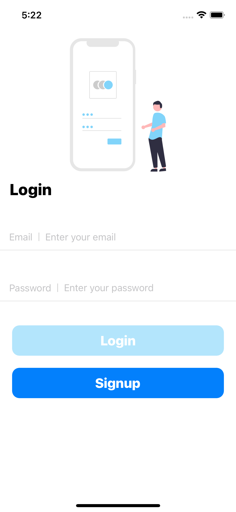
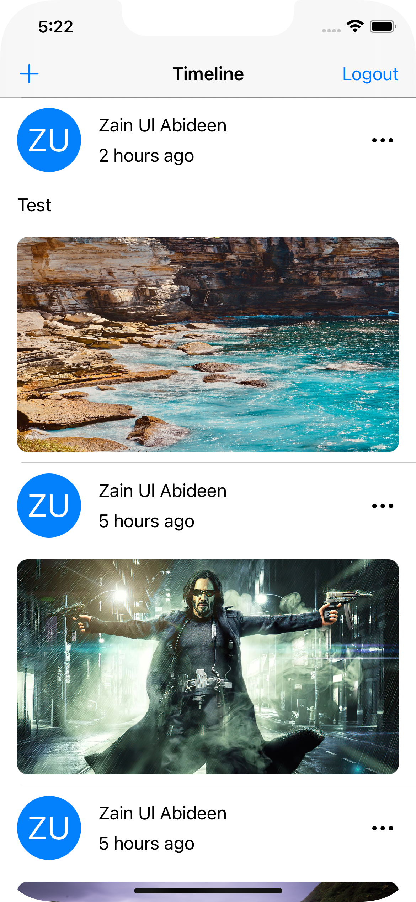

# Test_Nanameue 

## Screenshots
 

## Features

- [x] Login
-    Validation on Email.
-    Validation on password.
-    Enable and disable Login button based on validation.
- [x] Signup
-    Validation on Email.
-    Validation on password.
-    Enable and disable Signup button based on validation.
- [x] Create Post
-    Upload Image or Text.
-    Validation on post text.
-    Validation on post image.
-    User have to post something either image or text.
- [x] Delete Post
-    Post owner can delete the post.
- [x] Logout
-    Logout confirmation.

## Language
- Swift

## Design Pattern
- MVVM with observer

## Frameworks and libraries
- UIKit
- Firebase
- IQKeyboardManager
- SDWebImage
- ZainSPM

## Requirements

- iOS 14.0+
- Xcode 12

## Instal Cocoapods
#### Run pod install to install all the required libraries.
`pod install`

